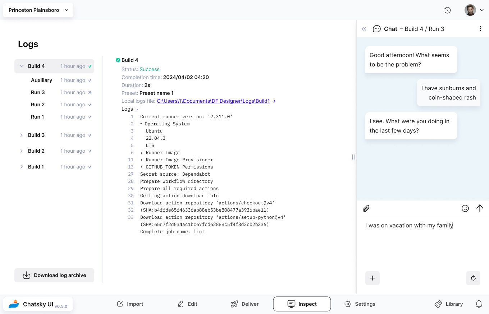
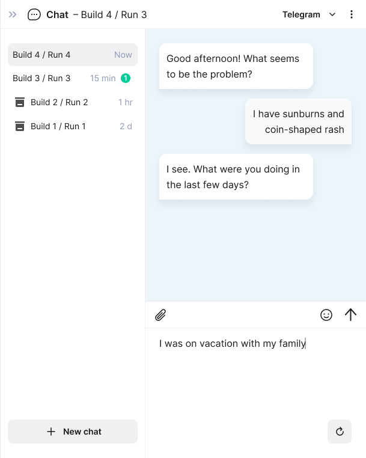
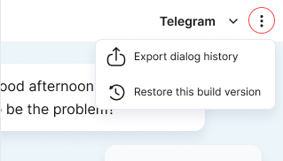

# Inspect

Inspect section of the app allows you to troubleshoot any issue with your bot. This is the place where you can test the bot in action by chatting with it and inspect all its builds and runs’ logs.

## Logs

Every action you take on [Deliver](../docs/deliver.mdx) page is recorded in logs under a corresponding name. You can select a build, a run or a test you have conducted and see if they were successful, and if not, what went wrong.

### Build and run logs

Build or run logs show the status, completion time, duration, chosen preset and logs themself which you can inspect in Chatsky UI or export by clicking a link.

## Chat preview

Chat window in Chatsky UI imitates your preferred messenger interface and changes its functionality depending on what interface you have chosen for every particular build.

import { Callout } from 'nextra/components'

<Callout type="info">
  Note that different messengers come with different features. For example, [button conditions](../docs/nodes/default_node.mdx#button) are available only on Telegram and will not be shown if your build is for other messengers.
</Callout>

### Start a conversation

Expand the chat window by pressing the expand **<<** button, then select a run on the list or click `New chat` and select a run in the dropdown. This new dialog is now live while the run is active. Running the bot with different settings allows you to test and compare several configurations at the same time.

Chat history is saved in the panel’s sidebar, so you can test several chats all at once. And if you have an unread message, then a green icon will show up, just like in a real messenger.

### Refresh dialog

If you want to start over and chat with your bot from the beginning, simply press the ‘Refresh‘ button.

### Messenger preview

Builds with 'Preview' messenger option let you not only to chat with the bot inside Chatsky UI, but also to preview different messenger interfaces. To test your bot in different interfaces, select one in the top bar of the chat window.

### More options

Pressing three dots at the top right corner of the chat window reveals two more options for chat management:

- Export dialog history to share it with your team members or for a future Chatsky UI project
- Restore an old build version if you like that chat best

