# Default node

Default node represents the state of the dialogue at the moment - the current bot response and all possible user replies (conditions) with the following transitions to other nodes.

You can see the default node on the image (_Coming soon_). The node name is placed at the top and is created only for your convenience. The responsе is located below, and all user replies - conditions - are located below it. 

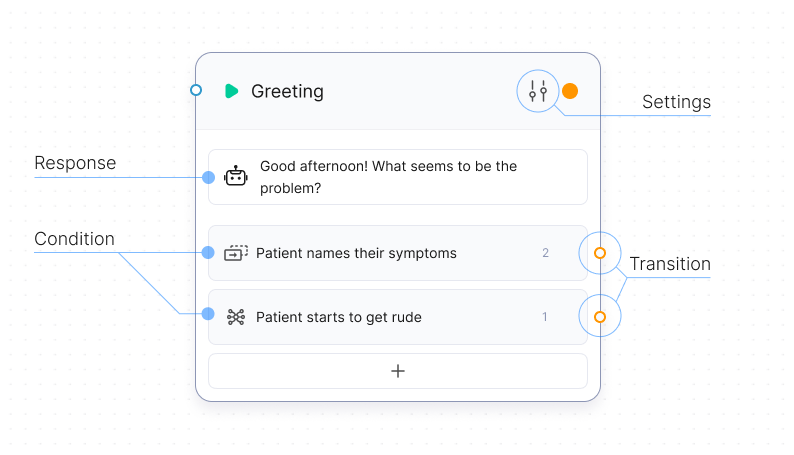

## Response

During the response configuration process, you enter the name of the response and select one of the three types of responses available in Chatsky UI:

### Prompt

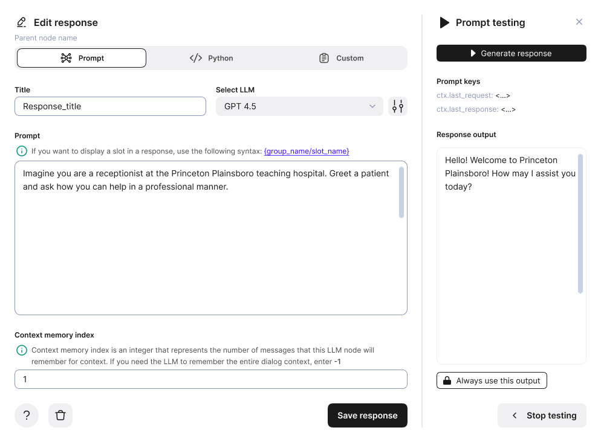

You can configure the response using an LLM prompt. This way, the bot's response will be unique every time and able to repeat the sentiment you need for the dialogue.

The view of the response configuration with the prompt is shown below. It consists of:

- the title that you will see on the node
- selection of the LLM model that will process the prompt
- prompt itself

You can also test the prompt. To do this, click the ‘Test prompt’ button and in the menu that opens, click the ‘Run’ button.

### Python

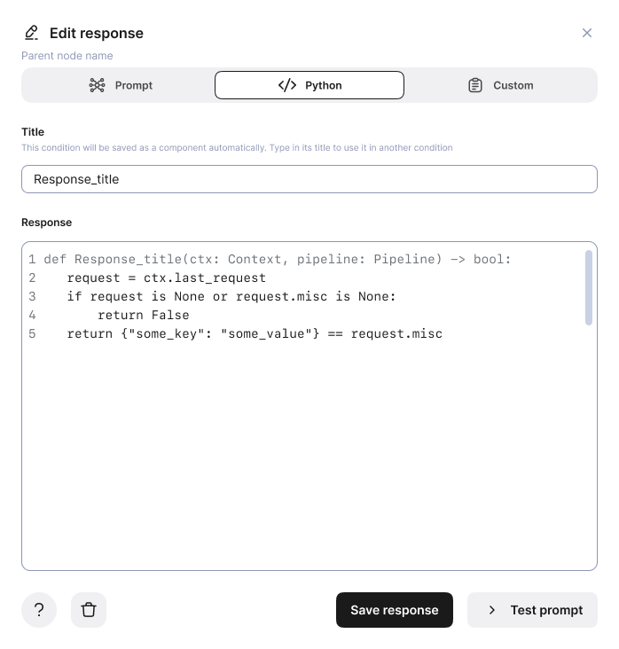

Python code is one of the most versatile ways to create a bot response, but it requires the ability to work with code. 

During the setup process, you need to set:

- response title
- Python code itself

You can also highlight individual code snippets and save them as components. These components will be available from the library.

### Quote

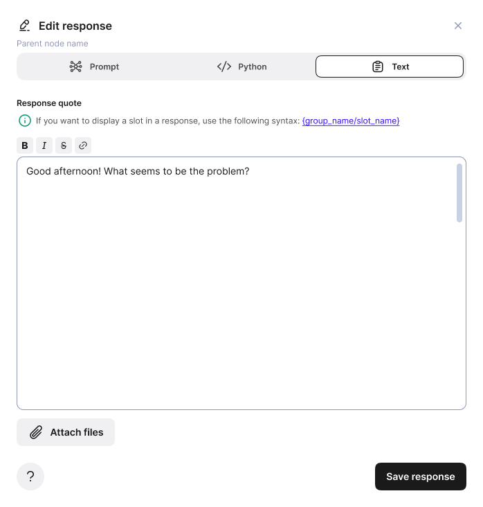

This is the simplest, but also the least versatile way to create a reponse. Just write the name of the response and a quote that the bot will send to the user in every dialogue cycle.

## Condition

Condition in Chatsky UI is an expectation of what an end user might say. If the condition is satisfied, dialog transitions to the according node.

Conditions can be configured in a number of ways:

### Prompt

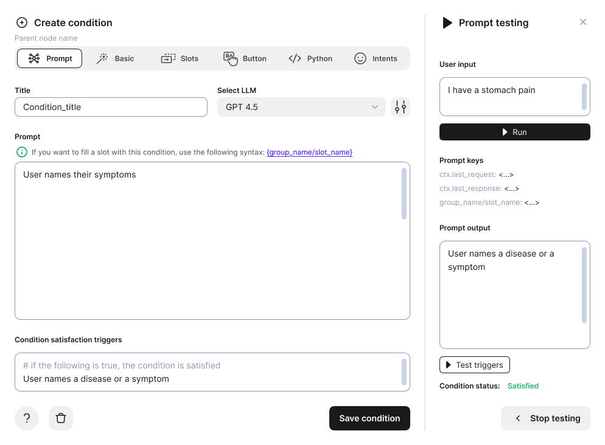

Similarly to responses, you can describe a condition with a prompt using an LLM.

Modal window structure:

- condition title that will show on the node
- model name and API key. If you have your LLM services configured in the settings, your default model and its API key will show
- prompt itself
- condition satisfaction triggers

You can also test your prompt before saving the condition. Click on the 'Test prompt' button, enter a sample user message and click 'Run'. The status message below will show if the condition has been satisfied.

### Basic

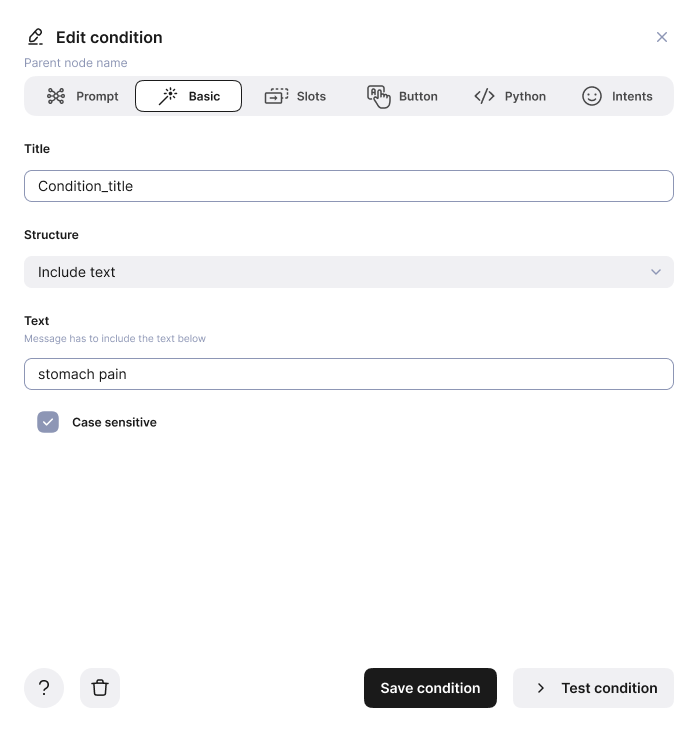

Basic conditions are designed for beginners and include only the simplest ways of configuring a condition. Condition title in this case is purely optional, however it helps distinguish the conditions you have created in the long run.

There are six structures of basic conditions:

1. Exact match: if user’s message fully matches the text in the box, only then the condition is satisfied
2. Include text: if user’s message includes the text in the box, the condition is satisfied
3. Regular expression: if the message matches the regexp structure in the box, the condition is satisfied
4. Any of: this structure allows you to configure several ways in which the condition is satisfied. After selecting ‘any of’, you can add any number of basic conditions, only one of which has to be triggered to satisfy the condition
5. All of: similarly, after selecting this option, you can add any number of basic conditions, all of which have to be triggered to satisfy the condition
6. Not: this structure just adds negation of the following basic condition

### Slots

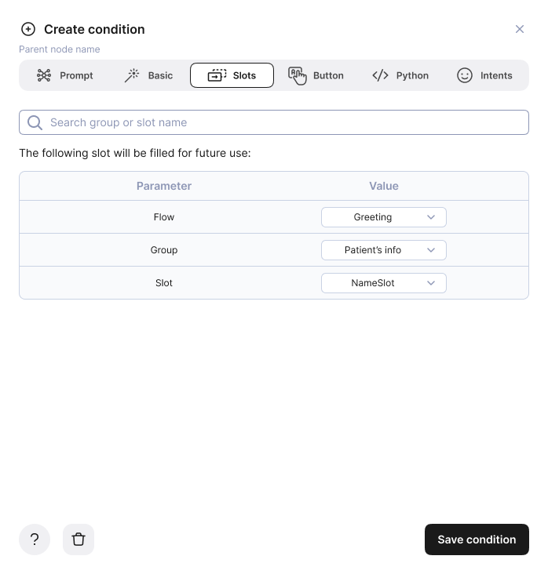

This condition type can be satisfied if user sends a message that contains the chosen slot.

To use slot condition, you need to first create a Slots node. Then, to configure the condition, select a flow containing the slots node, a group and a specific slot.

### Button

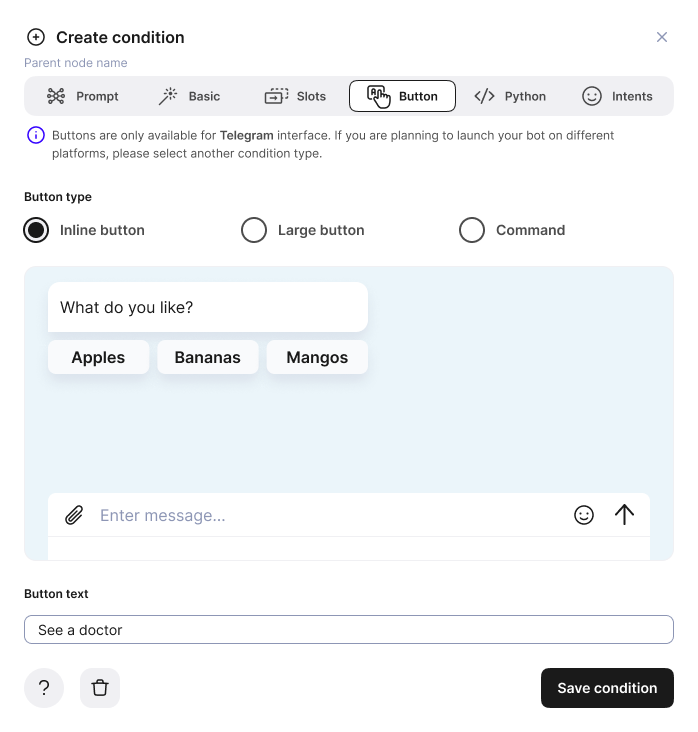

Button condition can only be used in Telegram messenger interface. It replaces entering a message manually with a set of buttons which can be helpful for bots with linear structure.

There are three types of button conditions:

- Inline button which sticks to its message bubble
- Large sticky button
- Command which shows on top of the text field and always starts with the slash: */command*

[Learn how to set up](../deliver#launch-to-telegram) messenger interfaces *in Chatsky UI.*

### Python

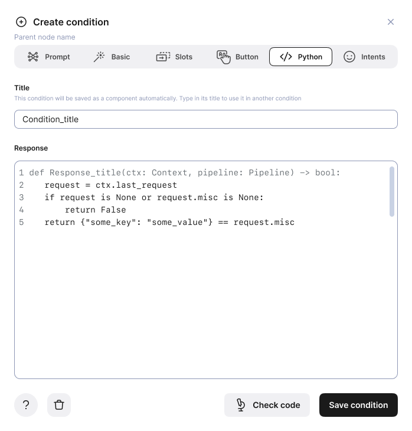

Similar to python responses. During the setup process, you need to set:

- condition title
- Python code itself

You can also highlight individual code snippets and save them as components. These components will be available from the library.

### Intents

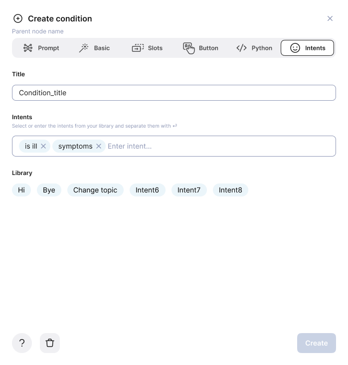

Intents condition allows you to select any number of intents which can be found in user’s message. To use this type of condition, you first need to upload intents to the library.

Then you can enter or select from the list below the intents, all of which have to be triggered to satisfy the condition. Separate the intents in the box using the 'Enter' key.

## Default node settings

Press the settings button next to the node name to configure your nodes even further.

In the settings window you can rename your node, enter its response window, set conditions’ priorities and even rearrange conditions list by dragging them up and down.

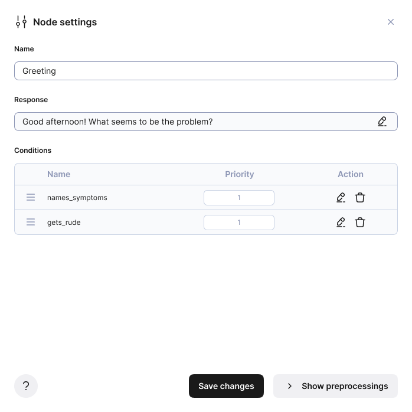

## Transitions

Every default node has to be connected to another one to work. Transitions work as such: a condition triggered in one node leads to a response in another node. To connect nodes, select a condition in the first one that has to be triggered, find the orange circle in the right hand side and drag it to the blue circle in the second node’s response.

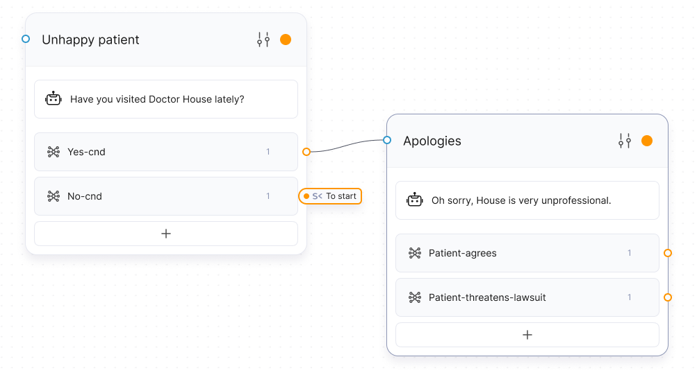

Note that a condition has to be linked to a single response, however different conditions can be linked to a single response.

There also are transition functions that allow you create connections not dependant on physical links between two nodes, but on functions that analyze following nodes and previous ones, so that if you rearrange them or change completely, the pattern will stay the same.

Here is the list of all transition functions:

1. Forward - transitions to the next node in the queue
2. Backward - transitions to the backward node in the queue
3. Previous - transitions to the previous node in the queue
4. Current - transitions one node’s condition to its own response
5. To start - transitions to the start node
6. To fallback - transitions to the fallback node

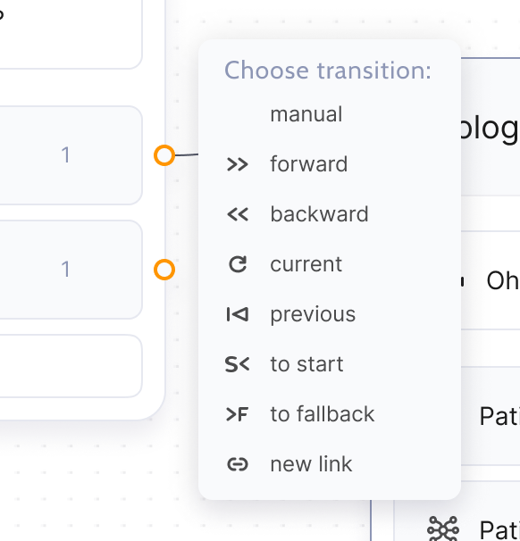

To apply a transition function, instead of dragging an orange circle next to a condition, click on it and a small window with all the functions will appear.

In order to make some of the functions work properly, you should check your graph using the list view. It shows every node of your flow as a list, the default order of which is chronological, based on when you have created every node.

You can access the list view by pressing the list button in the top bar of the Edit page. This view shows not only simple transitions, but also every function’s destination. If you want to rearrange some of your nodes, simply drag them up or down and drop where you prefer. All the transition functions will adjust automatically.

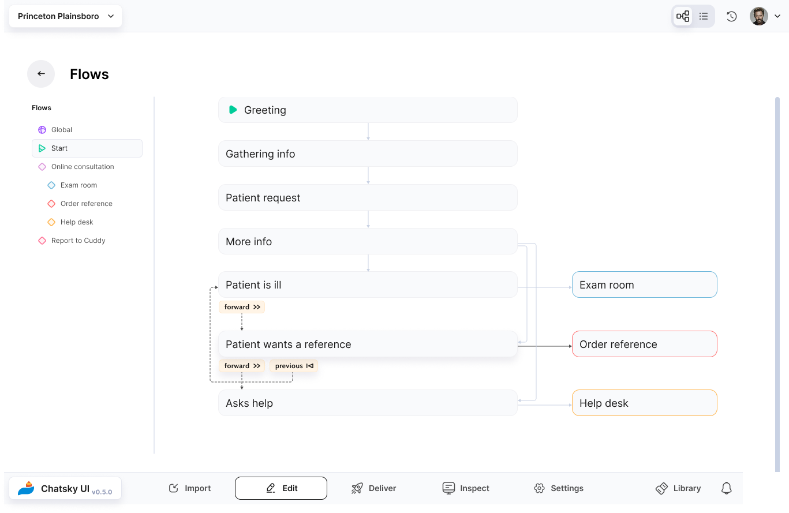
