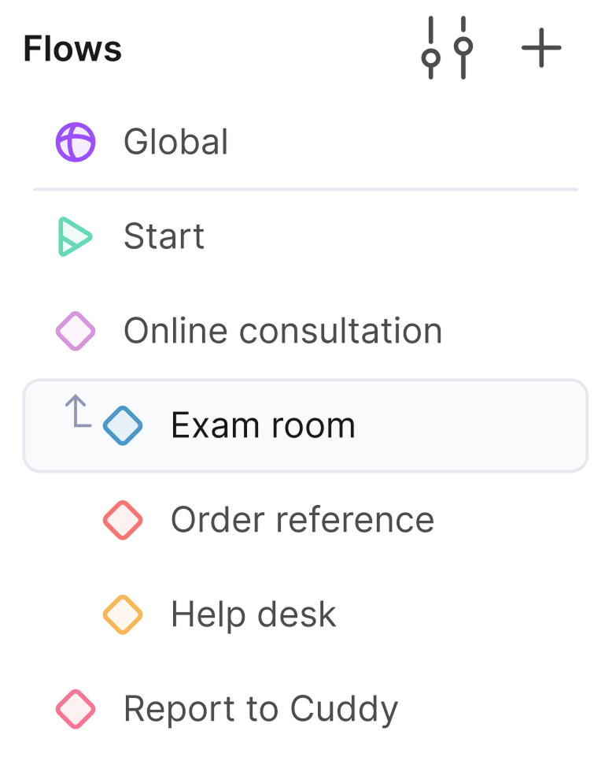
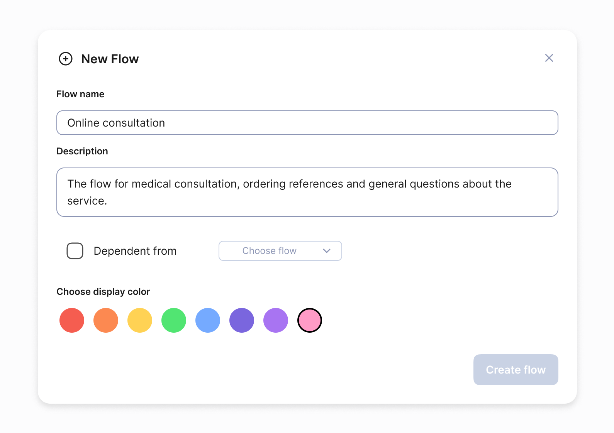
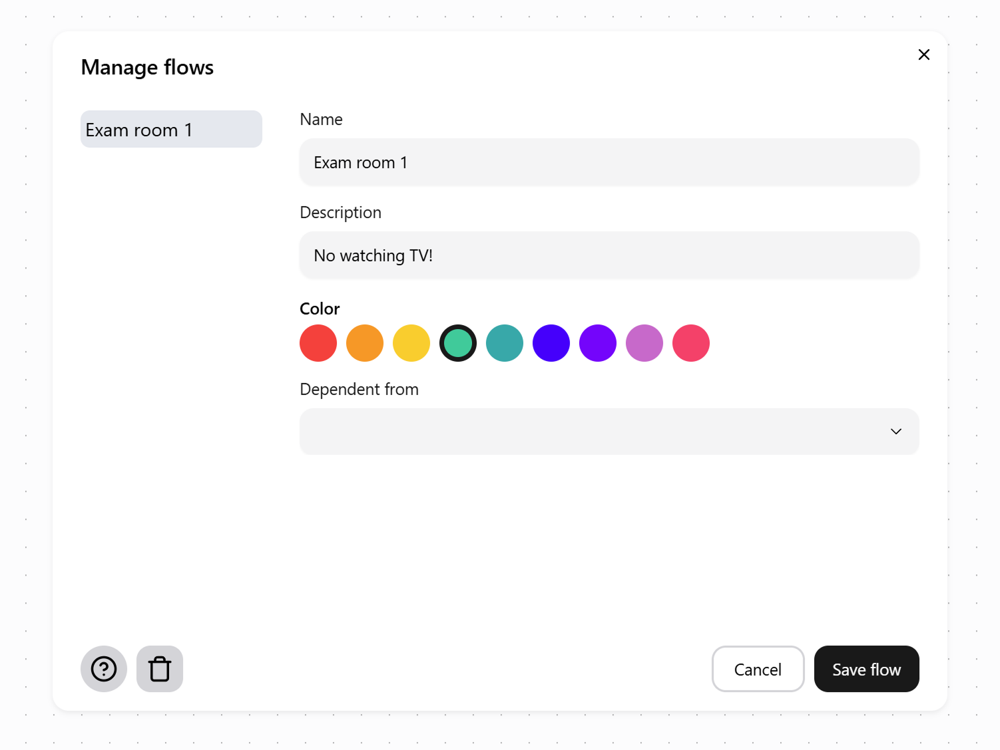

# Graph basics

**The graph** represents the course of the whole dialog with all the variants of its development that can occur while talking to your bot. In Chatsky UI, a graph consists of flows, essentially conversation topics, into which it is divided to simplify working on your bot. Each flow consists of nodes that represent current state of the bot along with all possible transitions to other nodes.

We will look at each element of the graph in detail below.

## Flows

**A flow** is the part of the graph in which a conversation with the bot on one specific topic takes place. For example, all dialog branches on the topic of online consultation with a medical bot should be placed in an 'Online consultation' flow.

### Flow list

The list of your flows is located in the left sidebar. Each flow has a name, a short description and a color label for easier navigation among them. You will also find there a search bar for flows and all of your components, a button for creating a new flow and a button for managing existing flows.

### Create a new flow

You can create a new flow by pressing ‘+‘ button in the sidebar. To configure the flow, enter its name, no shorter than two characters, a short description, and select a preferred color label.

### Manage and edit your flows

Pressing ‘Manage flows‘ button reveals a modal window where you can configure all your flows after you have created them. You can access all the same settings as in the ‘New flow’ window and reorder them.

## Nodes

**Nodes** are the core elements of your skill. A default node represents a state of the dialog, in which the bot has sent a message, and the user is yet to reply to it.

The in-depth explanation of nodes is available in [the corresponding section](../docs/nodes/default_node.mdx).
